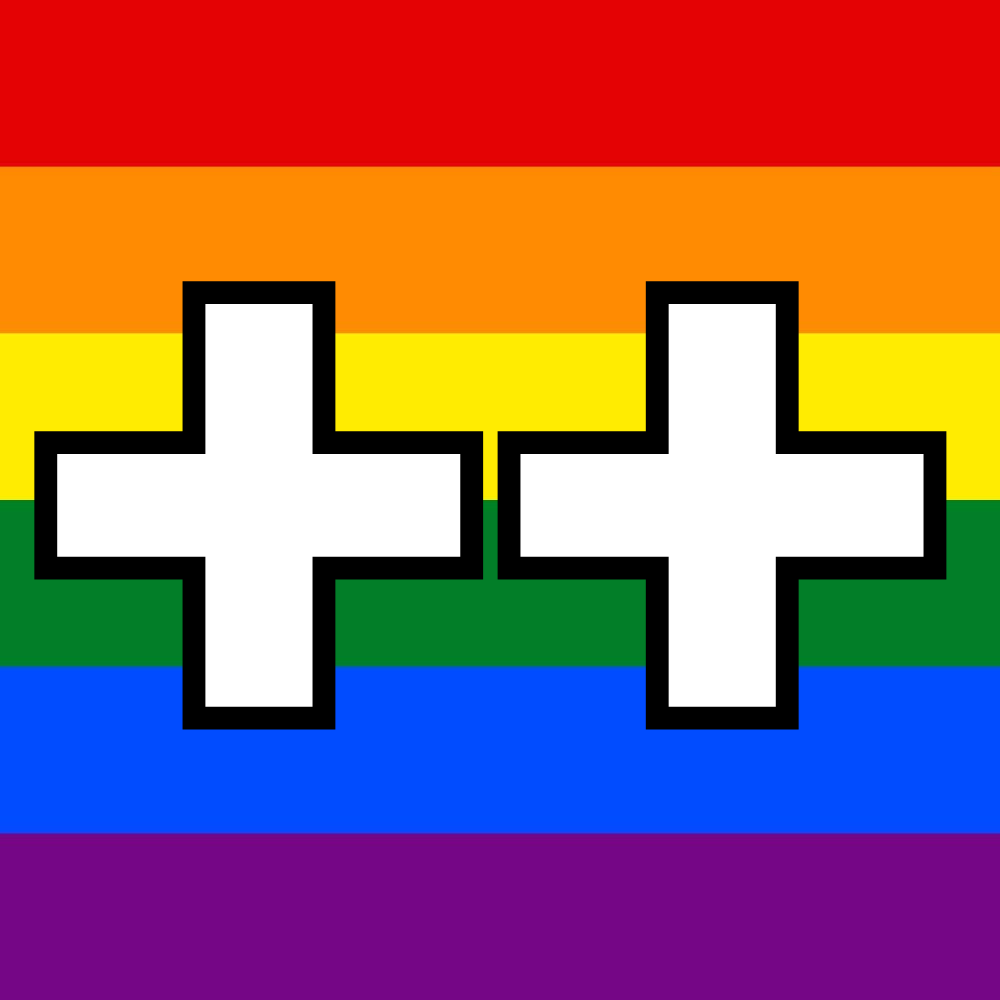

# LGBTQ++

Welcome to LGBTQ++ — the first programming language that positively embraces the culture of the LGBTQ+ community that isn't Rust! LGBTQ++ is a statically typed language, written by a team of queer programmers and allies, that aims to spread confidence, joy, and emotional validation to members of the community and allies alike with memorable syntax inspired by LGBTQ slang, popular culture, Chappell Roan, and Chappell Roan.

###### Written by Allen Boyce, JD Elia, Kyle Matton, Jacob Mendoza, [Sam Reitich](https://github.com/sreitich), and [Adi Roitburg](https://github.com/Adiro777).

## Features

* LBGTQ+ community-themed syntax
* Static typing, so you can be confident with your code before you go to work
* Built-in data structures to help you get do what you need to do
* Simplified JS-like syntax — focus on yourself; ignore the parentheses
* Validating error messages

## Example Programs

#### Hello World

| LGBTQ++ |          JavaScript           |
| ------- | ----------------------------- |
| `say("Hello World!")` |`console.log("Hello World!")`|

#### Variable Declaration

| LGBTQ++     | JavaScript  |
| :---------- | :---------- |
| `int x = 1` | `let x = 2` |

## Keywords Quick Reference

| LGBTQ++ | Patriarchy |
| :-----: | :--------: |
|         |            |
|         |            |
|         |            |
|         |            |
|         |            |
|         |            |
|         |            |
|         |            |
|         |            |

